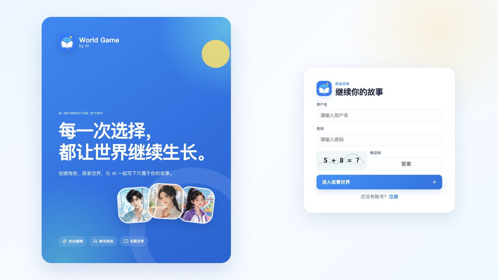
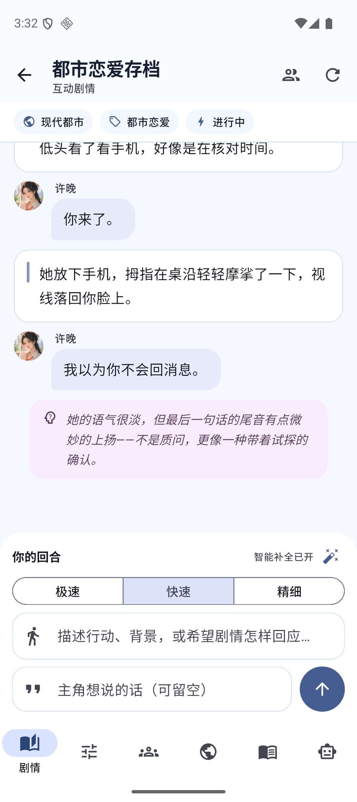
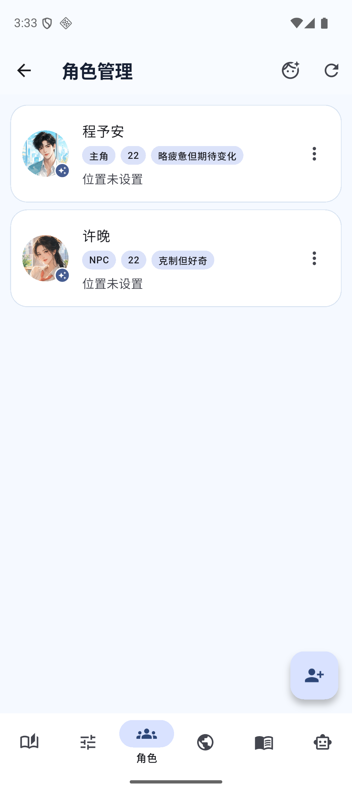
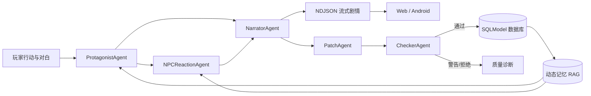

<p align="center">
  
</p>

<h1 align="center">World Game by AI</h1>

<p align="center">
  <strong>让 AI 不只会续写，也能记住世界、理解角色，并安全地推动一部长篇互动故事。</strong>
</p>

<p align="center">
  
  
  
  
</p>

<p align="center">
  <a href="#快速开始">快速开始</a> ·
  <a href="#功能全景">功能全景</a> ·
  <a href="#android-客户端">Android</a> ·
  <a href="#部署到公网">部署</a> ·
  <a href="docs/PROJECT_STATUS.md">项目状态</a> ·
  <a href="SECURITY.md">安全说明</a>
</p>

---

World Game by AI（仓库名 `WordGameByAI`）是一套完整开发版的 AI 互动文字 RPG：Vue 网页端与 Flutter Android 客户端共享 FastAPI 后端，通过结构化世界观、角色状态、动态记忆 RAG、多 Agent 叙事流水线和受控状态写入，持续推进可保存、可回溯、可管理的长篇故事。

它不是把聊天框直接接到大模型，而是把一次剧情生成拆成“理解玩家意图 → 推演角色反应 → 生成叙事 → 提取状态变化 → 一致性检查 → 安全落库”的应用流程。模型输出不理想时，系统还会区分格式/解析故障与 Prompt、上下文或模型内容质量问题，便于针对性调试。

> 当前项目适合个人部署、原型验证与小规模使用。正式商用、高并发或应用商店发布前，请先完成本文“生产边界”中的事项。

### Android 安装包

**[直接下载 World Game by AI Android v0.5.0+5 测试 APK](https://github.com/LiPeiCong60/WordGameByAI/raw/refs/tags/v0.5.0/releases/WorldGameByAI-android-v0.5.0-build5.apk)**（约 59 MiB）

```text
SHA-256  d4ce63f0f3bb5158546fb971380cbfcd831369e76fecea466af99149e6db71ac
```

该 APK 增加了可恢复上下文的模板智能助手，以及不暴露 JSON 的结构化开局角色编辑器。它仍使用测试签名并连接当前测试服务，仅用于安装体验；正式分发前必须改用 HTTPS、唯一包名和私有 release keystore。校验清单见 [`releases/SHA256SUMS.txt`](releases/SHA256SUMS.txt)。

## 界面预览

### Web

<p align="center">
  
</p>

### Android

<table>
  <tr>
    <td width="34%" align="center"></td>
    <td width="34%" align="center"></td>
    <td width="34%" align="center"></td>
  </tr>
  <tr>
    <td align="center">对话、动作、心理分层呈现</td>
    <td align="center">角色卡与标签化状态</td>
    <td align="center">AI 漫剧头像自动匹配</td>
  </tr>
</table>

## 项目亮点

- **完整的 Web + Android + API**：网页与 App 都能完成注册登录、建档、剧情、角色、世界、设定、管理助手和管理员功能。
- **八类 Agent 分工**：开场、主角理解、NPC 反应、旁白、状态补丁、检查、设定整理和管理提案各司其职。
- **可控的长篇状态**：世界、角色、关系、回合与快照均结构化存储，避免只依赖聊天上下文。
- **轻量动态记忆 RAG**：索引世界观、角色记忆与回合摘要，不依赖额外 Embedding 服务即可检索长期信息。
- **三档生成模式**：极速、快速、精细在延迟、状态整理与推演深度之间提供清晰取舍。
- **真正的流式剧情**：后端返回 NDJSON，Web 与 Android 均可边生成边展示。
- **对白结构化展示**：把旁白、动作、心理和角色台词解析为不同 UI，而不是把模型全文塞进一个文本框。
- **AI 写入有边界**：管理 Agent 先给出提案，只有用户确认后才执行；服务端再用 action 与字段白名单校验。
- **模板助手真正连续对话**：服务端恢复同一会话最近历史，“自动生成”“按刚才的做”等后续表达能继承上文；明确需求会直接生成完整待确认方案。
- **模板角色使用结构化表单**：Android 可逐个添加、编辑和删除主角/NPC，内部兼容历史 JSON，界面不再要求用户手写 JSON。
- **移动端可靠网络层**：安全令牌存储、401 自动刷新、请求幂等、分页与状态同步均已实现。
- **默认头像智能匹配**：没有上传图片时，根据姓名、性别、年龄、身份、外貌、性格和角色类型稳定匹配头像。

## 功能全景

| 能力 | Web | Android | API |
| --- | :---: | :---: | :---: |
| 验证码注册、登录、刷新令牌、注销 | ✅ | ✅ | ✅ |
| 存档创建、编辑、删除 | ✅ | ✅ | ✅ |
| 存档 JSON 导入 / 导出 | ✅ | ✅ | ✅ |
| 公共与私人世界模板 | ✅ | ✅ | ✅ |
| 模板助手历史恢复与开局角色表单 | ✅ | ✅ | ✅ |
| 世界 / 副本 CRUD 与当前世界切换 | ✅ | ✅ | ✅ |
| 世界观 CRUD 与 LoreAgent 整理 | ✅ | ✅ | ✅ |
| 完整角色卡 CRUD | ✅ | ✅ | ✅ |
| 上传、删除与恢复智能头像 | ✅ | ✅ | ✅ |
| 12 类默认头像与标签匹配 | ✅ | ✅ | 客户端匹配 |
| AI 开场、回合推进、NDJSON 流式输出 | ✅ | ✅ | ✅ |
| 行动与对白分离输入、空白智能补全 | ✅ | ✅ | ✅ |
| 极速 / 快速 / 精细模式 | ✅ | ✅ | ✅ |
| 指定回合重新生成与重新分支 | ✅ | ✅ | ✅ |
| 动态记忆浏览、检索与重建 | — | ✅ | ✅ |
| 管理 Agent 提案、确认与拒绝 | ✅ | ✅ | ✅ |
| 用户、会员、额度、模型池与等级管理 | ✅ | ✅ | ✅ |
| Token 用量统计 | ✅ | ✅ | ✅ |

网页剧情工作台另有旁白/聊天框模式、当前时间地点、主角与 NPC 状态侧栏、CheckerAgent 警告、桌面栏宽度调节及响应式导航。Android 客户端提供存档、剧情、角色、世界、设定、智能助手六个工作区，并包含管理员用户、模型池、模型等级与用量页面。

## 三种剧情生成模式

| 模式 | 适合场景 | 实际流程 |
| --- | --- | --- |
| **极速** | 试探方向、低延迟对话 | 跳过前置独立推演和完整状态整理，只应用 Hint 软状态。 |
| **快速** | 日常推进、兼顾速度 | 跳过前置主角/NPC LLM 推演，优先返回剧情，再在后台整理完整状态。 |
| **精细** | 关键剧情、复杂关系 | 完整执行主角、NPC、旁白、补丁与一致性检查流程。 |

## 多 Agent 与数据流



Agent 职责：

1. `OpeningAgent`：生成第一幕。
2. `ProtagonistAgent`：理解并结构化主角的行动与对白。
3. `NPCReactionAgent`：选择相关 NPC 并推演反应。
4. `NarratorAgent`：生成玩家可见剧情，支持流式输出。
5. `PatchAgent`：提取角色、世界与当前状态变化。
6. `CheckerAgent`：检查补丁一致性与安全性。
7. `LoreAgent`：把自然语言设定整理为结构化世界观。
8. `ManagementAgent`：生成管理修改提案，确认后才执行。

结构化 Agent 使用 JSON Object 输出和较低温度。完整模式下，Checker 未通过就不会应用完整状态补丁；内部 `STATE_HINT` 也会从玩家可见剧情中移除。

## 智能头像系统

项目内置 12 张明亮的 AI 漫剧风头像，覆盖儿童、少年、青年、中年和老年角色：

- 儿童：活泼男孩、好奇女孩
- 少年：沉静少年、灵动少女
- 青年：俊朗青年、优雅青年、硬朗青年、亲和青年
- 中年：沉稳男性、干练女性
- 老年：睿智男性、慈祥女性

匹配优先级为：用户上传图片 → 可访问的网络图片 → 标签自动匹配 → 稳定哈希兜底。同一角色在信息不变时会得到同一默认头像；删除上传图片后可恢复智能匹配。头像是 Web 与 App 的内置资源，并非服务器实时生成。

## 技术栈

| 层级 | 技术 |
| --- | --- |
| Web | Vue 3.5、Vite 6、Vue Router 4、Pinia 2、Axios、Lucide、原生 CSS |
| Android | Flutter、Dart ≥ 3.4、Material 3、Dio、flutter_secure_storage、file_picker、UUID |
| API | Python、FastAPI、SQLModel、Pydantic、Uvicorn |
| AI | LangChain、langchain-openai、ChatOpenAI、OpenAI-compatible API |
| 数据 | SQLite 或 MySQL、项目内稳定哈希向量 RAG |
| Android 构建 | Java 17、Android Gradle Plugin 9.0.1、Kotlin 2.3.20 |

## 项目结构

```text
WordGameByAI/
├── backend/
│   ├── agents/                 # 8 类 AI Agent
│   ├── routers/                # REST、流式及移动 API
│   ├── uploads/characters/     # 运行时头像；不提交实际文件
│   ├── game_engine.py          # 多 Agent 编排与状态任务
│   ├── prompt_builder.py       # Prompt 与结构化输出约束
│   ├── rag_service.py          # 动态记忆索引、检索与回合记忆
│   ├── patch_applier.py        # 白名单状态补丁
│   ├── story_quality_service.py
│   ├── auth_service.py
│   ├── model_config_service.py
│   ├── models.py
│   └── main.py
├── frontend/
│   ├── public/assets/          # 品牌图标和 12 张 WebP 头像
│   ├── src/api/
│   ├── src/components/
│   ├── src/stores/
│   ├── src/utils/
│   └── src/views/
├── mobile/
│   ├── assets/                 # Android 品牌和头像资源
│   ├── lib/core/               # 配置、网络、安全令牌与通用 UI
│   ├── lib/features/           # 登录、存档、剧情、管理与后台
│   ├── android/
│   └── test/
├── tests/                      # Python 后端测试
├── docs/
├── README.md
├── SECURITY.md
└── requirements.txt
```

## 快速开始

### 1. 获取源码

```bash
git clone https://github.com/LiPeiCong60/WordGameByAI.git
cd WordGameByAI
```

### 2. 启动后端

```bash
python3 -m venv .venv
source .venv/bin/activate
pip install -r requirements.txt

cp backend/.env.example backend/.env
cd backend
uvicorn main:app --reload --port 8000
```

在 `backend/.env` 中至少填写自己的 OpenAI-compatible 模型服务配置：

```env
OPENAI_API_KEY=your_api_key_here
OPENAI_BASE_URL=https://api.openai.com/v1
OPENAI_MODEL=gpt-4o-mini
DATABASE_URL=sqlite:///./narrative_agent.db
CORS_ALLOW_ORIGINS=http://localhost:5173,http://127.0.0.1:5173
ADMIN_BOOTSTRAP_TOKEN=replace_with_a_long_random_secret
ALLOW_FIRST_USER_ADMIN=false
```

> 不配置 API Key 时，账号、存档和数据管理仍可启动；调用 AI Agent 时会返回明确的配置错误。真实密钥只能保存在本地或服务器 `.env` / 私有模型配置中，不能提交到 Git。

后端入口：

- Swagger：`http://localhost:8000/docs`
- Web API：`http://localhost:8000/api`
- Mobile API：`http://localhost:8000/api/v1`
- 健康检查：`http://localhost:8000/api/health`

### 3. 启动网页端

```bash
cd frontend
npm ci
npm run dev
```

默认访问 `http://localhost:5173`。连接其他后端时：

```bash
VITE_API_BASE_URL=http://localhost:8000/api npm run dev
```

生产构建：

```bash
VITE_API_BASE_URL=https://your-domain.example/api npm run build
```

## Android 客户端

`mobile/` 已包含 Android 平台工程，不要再次运行 `flutter create` 覆盖它。

### 本地模拟器调试

```bash
cd mobile
flutter pub get
flutter run \
  --dart-define=API_BASE_URL=http://10.0.2.2:8000/api/v1
```

### 公网 API 构建

```bash
flutter build apk --release \
  --dart-define=API_BASE_URL=https://your-domain.example/api/v1
```

Android 令牌通过 Keychain/Keystore 安全存储；遇到 401 会自动轮换刷新令牌并重试。当前 `0.5.0+5` APK 仍属于测试发行版：应用 ID 是 `com.example.word_game_by_ai`，release 构建仍使用开发签名，且开发 Manifest 为兼容临时 IP 服务允许 HTTP。提交应用商店前必须改为唯一包名、正式私有签名和 HTTPS，并禁止 release 明文流量。

更多说明见 [mobile/README.md](mobile/README.md)。

## API 设计

核心资源同时提供两套前缀：

- Web 兼容接口：`/api`
- 移动版本接口：`/api/v1`

移动端额外提供聚合与同步接口：

```text
GET /api/v1/mobile/config
GET /api/v1/games/{id}/bootstrap
GET /api/v1/games/{id}/turns
GET /api/v1/games/{id}/state-sync
GET /api/v1/management/sessions/{id}/messages
```

接口特性包括 NDJSON 流式剧情、`request_id` / `X-Request-ID` 幂等、单存档生成租约、游标分页、短窗限流、每日额度、存档归属校验和管理员权限。完整的 60 多个路由及请求模型请以运行时 Swagger `/docs` 为准。

## 测试与质量

当前源码通过 79 项自动化测试：

| 测试层 | 数量 | 重点 |
| --- | ---: | --- |
| Python 后端 | 51 | 认证、权限、RAG、管理会话上下文、模板生成、并发租约、事务、Prompt 脱敏、JSON 容错、额度、头像 |
| Flutter | 23 | API 错误、剧情拆分、模板助手、结构化模板角色表单、网络层、默认头像 |
| Vue / Node | 5 | 默认头像资源与标签匹配 |

运行命令：

```bash
# 后端
python -m unittest discover -s tests -v

# Web
cd frontend && npm test && npm run build

# Android
cd mobile && flutter analyze && flutter test
```

网页端目前只有头像工具测试，尚未建立组件测试与 E2E；“79 项通过”不等同于完整生产验收。

## 安全与隐私

发布仓库只应包含源码和演示资源：

- `.env`、模型私有配置及备份、数据库及 WAL/SHM、用户上传、日志、签名文件、Firebase/Apple 配置、依赖与构建产物均被 `.gitignore` 排除。
- 密码使用 PBKDF2-SHA256、240,000 次迭代和随机盐。
- 数据库只保存访问令牌与刷新令牌哈希；刷新令牌会轮换，注销会撤销会话。
- 首位管理员必须提供服务端 `ADMIN_BOOTSTRAP_TOKEN`；公开注册默认不会自动提权。
- 普通用户只能操作自己的存档。
- 模型管理接口只返回 `has_api_key`，不会返回 API Key 明文；私有配置写入后会尝试设置为 `0600`。
- 头像上传限制 PNG/JPEG/WebP，检查文件签名，最大 2 MiB。
- AI 修改必须经过提案确认与服务端白名单。

仍需了解的边界：Web 令牌当前存放在 `localStorage`；内置验证码是轻量算术验证码；头像上传目录经 `/uploads` 提供静态访问。正式开放注册前建议迁移 HttpOnly/Secure/SameSite Cookie、增加 IP/账号登录限速，并接入 Turnstile、hCaptcha 或 reCAPTCHA。

请阅读 [SECURITY.md](SECURITY.md)。如发现漏洞，不要在公开 Issue 中粘贴密钥、令牌、用户数据或可直接利用的细节。

## 部署到公网

```text
Browser / Android
        │ HTTPS
        ▼
      Nginx
   ├── /          → frontend/dist
   ├── /api       → 127.0.0.1:8010
   └── /uploads   → backend/uploads
        │
        ▼
 FastAPI + MySQL
        │
        ▼
OpenAI-compatible LLM
```

生产原则：

- FastAPI 只监听 `127.0.0.1:8010`，不直接暴露应用端口。
- `/api`、`/api/v1` 和 `/uploads` 都通过 Nginx/Caddy 反代。
- Web 与 Android 统一使用 HTTPS。
- `.env`、模型私有配置、数据库、上传文件和签名材料只留在服务器或 CI Secret。
- SQLite 适合本地开发；正式多人服务建议 MySQL，并配置数据库与上传目录备份。
- 前端构建时写入正式 API 域名；更新源码不会自动把 SQLite 数据迁移到 MySQL。

详细步骤：

- [公网部署准备清单](docs/公网部署准备清单.md)
- [公网部署与迁移手册](docs/公网部署与迁移手册.md)

## 已知限制与路线图

- AI 质量、延迟和费用取决于外部模型服务。
- 当前 RAG 是轻量稳定哈希向量，不是专业 Embedding + 向量数据库。
- SQLite、本地上传和进程内任务不适合多实例横向扩展。
- 数据库升级仍使用启动时轻量迁移，尚未引入 Alembic。
- 尚无 Docker / Docker Compose、GitHub Actions 和端到端测试。
- “分支”目前是从指定回合删除后续再生成，不是多分支树并存。
- Android 上架所需正式包名、release keystore、HTTPS 强制和商店材料尚未完成。
- iOS 平台目录存在，但本阶段只完成并验证 Android，不宣称正式支持 iOS。
- Web 登录态未来应迁移到服务端 HttpOnly Cookie。
- 默认头像可继续扩充风格、年龄与更多角色标签。

优先路线：生产 HTTPS 与 Android 正式签名 → Docker 化和 Alembic → CI + Web/Android E2E → Redis/任务队列与对象存储 → 专业向量数据库与可选 Embedding → iOS 验证。

## 文档

- [项目说明书](docs/项目说明书.md)
- [项目状态](docs/PROJECT_STATUS.md)
- [AI 输出质量诊断](docs/AI_OUTPUT_QUALITY.md)
- [公网部署准备清单](docs/公网部署准备清单.md)
- [公网部署与迁移手册](docs/公网部署与迁移手册.md)
- [安全与隐私](SECURITY.md)

## 贡献与许可

欢迎通过 Issue 提交可复现的问题、功能建议或文档改进，并在 Pull Request 中附上对应测试。

当前仓库尚未附加开源许可证，默认保留全部权利（All rights reserved）。公开可见不代表允许复制、修改或再分发；如需将项目正式开源，请由仓库所有者选择并添加 MIT、Apache-2.0、GPL 等合适许可证。
