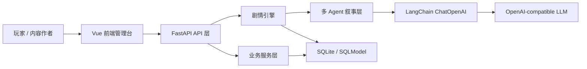
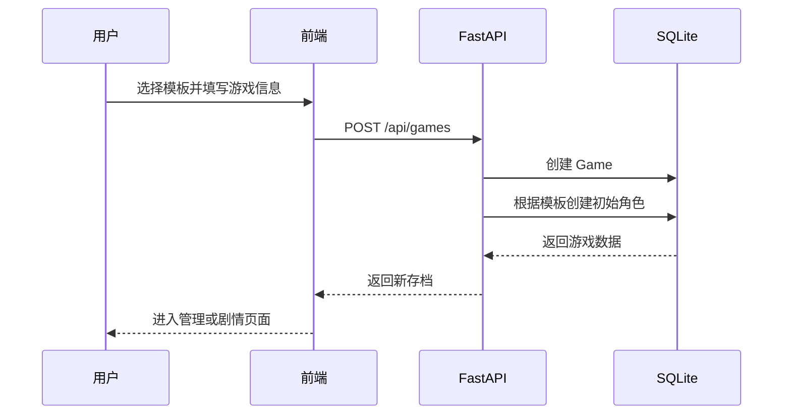
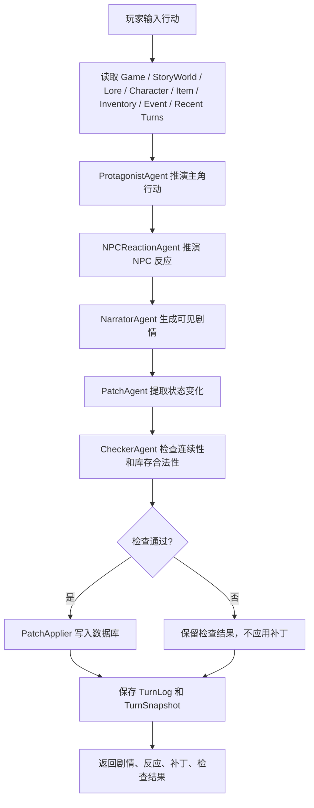
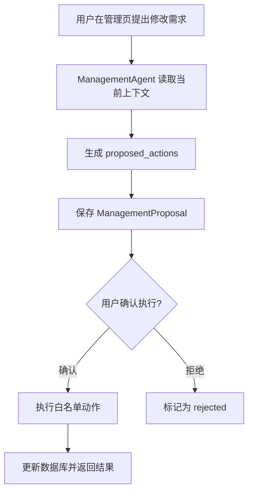

# WordGameByAI 项目说明书

版本：0.1.0

日期：2026-06-28

仓库：[LiPeiCong60/WordGameByAI](https://github.com/LiPeiCong60/WordGameByAI)

## 1. 项目概述

WordGameByAI 是一个通用 AI 文字 RPG 引擎原型。项目并不是单纯的聊天页面，而是把 AI 叙事、世界观管理、角色卡、物品库存、世界事件、存档导入导出和多 Agent 剧情推进整合到一个结构化游戏框架中。

项目当前实现为本地可运行 Demo，适合用于验证 AI 文字游戏的基础玩法、数据结构、状态更新、安全确认机制和后续扩展方向。

## 2. 项目目标

- 提供一个可运行的 AI 文字游戏框架，而不是一次性 Prompt。
- 使用结构化数据维护游戏世界，减少长篇对话中的设定漂移。
- 将剧情生成、NPC 反应、状态补丁、连续性检查拆分为多个 Agent。
- 支持角色、物品、库存、世界观、事件和存档的可视化管理。
- 在管理型修改中加入用户确认流程，避免 AI 直接写入关键数据。
- 保持开源发布安全，不提交真实 API Key、本地数据库、用户上传文件和个人存档。

## 3. 适用对象

- 玩家：创建自己的文字 RPG 存档，通过行动输入推进剧情。
- 内容创作者：维护世界观、角色、道具、事件和剧情状态。
- 开发者：基于现有 Demo 扩展任务系统、规则引擎、RAG 记忆、多人权限或部署能力。
- 课程/项目评审：查看 AI 游戏框架的功能边界、数据设计和系统架构。

## 4. 核心功能

| 功能模块 | 说明 |
| --- | --- |
| 游戏存档 | 创建、编辑、删除游戏，维护题材、世界类型、基调、叙事视角和当前状态。 |
| 模板系统 | 内置都市恋爱、玄幻修真、丧尸末日、快穿任务、科幻远征、自定义空白模板。 |
| 世界/副本 | 维护 StoryWorld，可设置任务目标、完成条件、失败条件和剧情偏移度。 |
| 世界观 | 管理 WorldLore 条目，支持调用 LoreAgent 整理自然语言设定。 |
| 角色卡 | 管理主角、NPC、反派、阵营代表等角色信息，支持头像上传。 |
| 物品定义 | 维护装备、消耗品、关键道具、资源、载具、情报等物品。 |
| 库存系统 | 使用 InventoryRecord 管理角色、队伍、地点、阵营、世界拥有的物品。 |
| 世界事件 | 维护背景事件、关键事件、伏笔事件、关系事件等 WorldEvent。 |
| 剧情推进 | 玩家输入行动后，多 Agent 协作生成剧情、反应、状态补丁和检查结果。 |
| 管理 Agent | 在管理页生成修改方案，用户确认后才执行白名单动作。 |
| 导入导出 | 导出完整存档 JSON，导入时创建新的游戏存档。 |

## 5. 技术栈

| 层级 | 技术 |
| --- | --- |
| 后端 | Python、FastAPI、SQLModel、Pydantic、SQLite、LangChain、langchain-openai |
| 前端 | Vue 3、Vite、Vue Router、Pinia、Axios、lucide-vue-next |
| AI 接口 | LangChain ChatOpenAI + OpenAI-compatible Chat Completions API |
| 数据库 | 本地 SQLite，默认文件为 `backend/narrative_agent.db` |
| 配置 | `backend/.env`，公开模板为 `backend/.env.example` |

## 6. 总体架构



前端负责游戏管理和交互界面；后端负责 API、业务校验、数据库写入和 AI 调用；剧情引擎负责编排多 Agent，并把可见剧情、NPC 反应、状态补丁和检查结果保存为回合日志。

## 7. 后端模块设计

| 模块 | 文件/目录 | 职责 |
| --- | --- | --- |
| 应用入口 | `backend/main.py` | 创建 FastAPI 应用、注册路由、挂载上传目录、启动时初始化数据库。 |
| 数据库 | `backend/database.py` | 创建 SQLModel engine，初始化表结构，种子化默认模板。 |
| 数据模型 | `backend/models.py` | 定义 Game、Character、Item、InventoryRecord、TurnLog 等核心表。 |
| Schemas | `backend/schemas.py` | 定义 API 请求/响应模型。 |
| 剧情引擎 | `backend/game_engine.py` | 读取游戏上下文，编排 Agent，保存 TurnLog 和 TurnSnapshot。 |
| 状态补丁 | `backend/patch_applier.py` | 将 AI 生成的 state_patch 安全应用到数据库。 |
| 库存服务 | `backend/inventory_service.py` | 使用、装备、卸下、转移物品时进行强校验。 |
| 管理服务 | `backend/management_service.py` | 保存管理对话、生成方案、确认执行白名单动作。 |
| 导入导出 | `backend/export_import.py` | 导出完整存档 JSON，导入时重建数据关系。 |
| 路由层 | `backend/routers/` | 按 games、characters、items、turns 等功能拆分 API。 |
| Agent 层 | `backend/agents/` | 封装开场、主角、NPC、旁白、补丁、检查、设定整理等 Agent。 |
| LLM 客户端 | `backend/llm_client.py` | 通过 LangChain `ChatOpenAI` 调用 OpenAI-compatible API，支持普通和流式输出。 |

## 8. 前端模块设计

| 模块 | 文件/目录 | 职责 |
| --- | --- | --- |
| 应用入口 | `frontend/src/main.js` | 创建 Vue 应用，注册 Pinia 和 Router。 |
| 主布局 | `frontend/src/App.vue` | 顶层界面、导航和全局布局。 |
| 路由 | `frontend/src/router/index.js` | 管理页面路由，包括进行、管理、模板、角色、物品等页面。 |
| API 封装 | `frontend/src/api/` | 封装 Axios 请求，按业务模块拆分接口。 |
| 状态管理 | `frontend/src/stores/` | 保存当前游戏、UI 状态等前端状态。 |
| 视图页面 | `frontend/src/views/` | 游戏列表、剧情进行、综合管理、角色、物品、库存、世界、设定、事件等页面。 |
| 组件 | `frontend/src/components/` | 角色卡、库存面板、剧情日志、管理 Agent 面板等复用组件。 |
| 样式 | `frontend/src/styles/main.css` | 全局 UI 样式。 |

## 9. 核心业务流程

### 9.1 创建游戏流程



### 9.2 剧情推进流程



### 9.3 管理 Agent 修改流程



### 9.4 库存操作流程

库存的使用、装备、卸下、转移动作不直接相信自然语言输入，而是调用后端库存服务进行校验：

- 角色或拥有者必须真实拥有该物品。
- 数量不足时拒绝使用或转移。
- `lost`、`broken`、`consumed` 状态不能正常使用。
- 消耗品使用成功后扣减数量。
- 关键物品默认不能普通消耗，除非配置明确允许。
- 装备和卸下动作必须检查归属关系和装备状态。

## 10. 数据模型说明

| 表/模型 | 作用 |
| --- | --- |
| `Game` | 游戏存档主体，保存题材、世界类型、文风、规则摘要和当前状态。 |
| `WorldTemplate` | 世界模板，保存默认题材、规则、文风和初始角色字段。 |
| `StoryWorld` | 世界或副本，保存任务目标、完成条件、失败条件和剧情偏移度。 |
| `WorldLore` | 世界观条目，按分类、canon level、重要度维护设定。 |
| `Character` | 角色卡，保存外貌、性格、说话风格、目标、关系、记忆摘要等。 |
| `Item` | 物品定义，保存类型、状态、稀有度、是否可装备/消耗/交易等。 |
| `InventoryRecord` | 库存记录，连接物品和拥有者，保存数量、装备状态和存放位置。 |
| `WorldEvent` | 世界事件，保存事件类型、参与者、后果、状态和重要度。 |
| `TurnLog` | 剧情回合记录，保存玩家输入、AI 回复、NPC 反应、补丁和检查结果。 |
| `TurnSnapshot` | 回合前快照，用于回档、再生成和历史恢复。 |
| `ManagementSession` | 管理页对话会话。 |
| `ManagementProposal` | 管理 Agent 生成的待确认修改方案。 |

## 11. API 概览

| 功能 | 主要接口 |
| --- | --- |
| 游戏 | `POST /api/games`、`GET /api/games`、`GET /api/games/{game_id}`、`PATCH /api/games/{game_id}`、`DELETE /api/games/{game_id}` |
| 模板 | `GET /api/templates`、`POST /api/templates`、`PATCH /api/templates/{template_id}`、`DELETE /api/templates/{template_id}` |
| 世界/副本 | `POST /api/games/{game_id}/story-worlds`、`GET /api/games/{game_id}/story-worlds`、`POST /api/games/{game_id}/story-worlds/{world_id}/set-current` |
| 世界观 | `POST /api/games/{game_id}/lore`、`GET /api/games/{game_id}/lore`、`POST /api/games/{game_id}/lore/organize` |
| 角色 | `POST /api/games/{game_id}/characters`、`GET /api/games/{game_id}/characters`、`POST /api/characters/{character_id}/avatar` |
| 物品 | `POST /api/games/{game_id}/items`、`GET /api/games/{game_id}/items`、`PATCH /api/items/{item_id}` |
| 库存 | `POST /api/games/{game_id}/inventory`、`GET /api/games/{game_id}/inventory`、`POST /api/inventory/use`、`POST /api/inventory/transfer` |
| 剧情 | `POST /api/games/{game_id}/opening`、`POST /api/games/{game_id}/turn`、`POST /api/games/{game_id}/turn/stream` |
| 管理 Agent | `POST /api/games/{game_id}/management/sessions`、`POST /api/management/sessions/{session_id}/chat`、`POST /api/management/proposals/{proposal_id}/apply` |
| 存档 | `GET /api/games/{game_id}/export`、`POST /api/games/import` |

完整接口文档可在后端启动后访问 `http://localhost:8000/docs`。

## 12. 安装与运行

### 12.1 后端

```bash
python3 -m venv .venv
source .venv/bin/activate
pip install -r requirements.txt

cd backend
cp .env.example .env
uvicorn main:app --reload --port 8000
```

### 12.2 前端

```bash
cd frontend
npm install
npm run dev
```

默认访问地址：

- 前端：`http://localhost:5173`
- 后端接口：`http://localhost:8000/api`
- 后端文档：`http://localhost:8000/docs`

## 13. 配置说明

公开模板文件：`backend/.env.example`

```env
OPENAI_API_KEY=your_api_key_here
OPENAI_BASE_URL=https://api.openai.com/v1
OPENAI_MODEL=gpt-4o-mini
DATABASE_URL=sqlite:///./narrative_agent.db
```

| 配置项 | 说明 |
| --- | --- |
| `OPENAI_API_KEY` | LLM API Key，本地私密配置，不应提交。 |
| `OPENAI_BASE_URL` | OpenAI-compatible API 地址。 |
| `OPENAI_MODEL` | 使用的模型名称。 |
| `DATABASE_URL` | 数据库连接地址，默认使用本地 SQLite。 |

未配置 API Key 时，系统不会崩溃，Agent 会返回友好错误提示。LLM 调用层基于 `langchain-openai` 的 `ChatOpenAI` 实现，可通过 `OPENAI_BASE_URL` 接入兼容 OpenAI 协议的模型服务。

## 14. 安全与隐私控制

项目已经设置以下发布控制：

- `.gitignore` 忽略真实 `.env`、本地数据库、上传文件、虚拟环境、依赖目录、构建产物、缓存和日志。
- 仓库只保留 `backend/.env.example`，不提交真实 API Key。
- 不提交 `backend/narrative_agent.db`，避免暴露本地存档、剧情记录和角色数据。
- 不提交 `backend/uploads/` 中的用户上传头像或其他媒体文件，只保留 `.gitkeep` 占位。
- ManagementAgent 执行数据库修改前必须生成 proposal 并等待用户确认。
- 管理动作只允许白名单 action，禁止任意 SQL、删除数据库、修改 API Key 或绕过关键物品保护。
- 库存相关操作由后端服务强校验，不仅依赖 AI 文本生成。

如果密钥曾被误提交，应立即在对应平台轮换密钥，并在公开仓库前清理 git 历史。

## 15. 当前验证情况

本项目在发布前已进行以下基础验证：

- Python 后端源码通过 `python3 -m compileall backend` 编译检查。
- 前端通过 `npm run build` 构建检查。
- 前端依赖通过 `npm audit`，结果为 `0 vulnerabilities`。
- 发布前执行了高置信度密钥扫描，未发现 API Key、GitHub token 或私钥块。
- 使用 `git check-ignore` 验证 `.env`、数据库、上传文件、依赖目录和构建产物会被忽略。

## 16. 当前限制

- 这是本地 Demo，暂未加入用户账号、权限、多人协作和生产部署配置。
- SQLite 适合单机验证，多用户并发需要迁移到 PostgreSQL 等数据库。
- Agent 调用依赖外部 LLM，质量、延迟和费用取决于模型服务。
- 文本输入中的物品使用意图尚未做完整自然语言解析，强校验推荐通过库存页按钮完成。
- 长篇记忆压缩、RAG 检索、任务系统、地点系统和阵营系统仍属于后续扩展方向。

## 17. 后续规划

- 增加 RAG 世界观检索和长篇记忆压缩。
- 增加 PostgreSQL / pgvector 支持。
- 增加存档版本化、回档和分支剧情管理。
- 增加更强的规则引擎，减少完全依赖 LLM 的一致性判断。
- 增加任务 Agent、地点 Agent、阵营 Agent。
- 增加文本输入前置意图解析和库存预校验。
- 增加流式剧情生成的前端体验优化。
- 增加部署文档、Docker Compose 和生产环境安全配置。

## 18. 目录结构

```text
.
├── backend/
│   ├── agents/
│   ├── routers/
│   ├── uploads/
│   ├── database.py
│   ├── game_engine.py
│   ├── inventory_service.py
│   ├── llm_client.py
│   ├── main.py
│   ├── management_service.py
│   └── models.py
├── frontend/
│   ├── src/
│   │   ├── api/
│   │   ├── components/
│   │   ├── router/
│   │   ├── stores/
│   │   └── views/
│   ├── package.json
│   └── vite.config.js
├── docs/
│   └── 项目说明书.md
├── README.md
├── SECURITY.md
└── requirements.txt
```

## 19. 总结

WordGameByAI 当前已经具备 AI 文字 RPG 的基本框架能力：它用结构化数据库维护世界和状态，用多 Agent 负责不同叙事职责，用管理确认机制降低 AI 误写入风险，并保留了从 Demo 演进到完整 AI 游戏平台的扩展空间。
